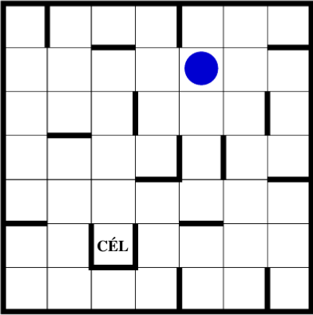

Maze-model
==========

Az abran lathato kek golyot kell a felhasznalonak eljuttatni a celba.

A golyo negy egtajba mozoghat: Eszak, Kelet, Del, Nyugat. Ha a felhasznalo elinditja valamely egtaj iranyaba akkor a golyo addig megy mig falba, vagy a palya szelebe nem utkozik.

Feladat megoldasa:  
1.) RIGHT  
2.) DOWN  
3.) LEFT  
4.) DOWN  
5.) LEFT  
6.) UP  
7.) LEFT  
8.) DOWN  
9.) LEFT  
10.) UP  
11.) RIGHT  
12.) UP  
13.) RIGHT  
14.) UP  
15.) LEFT  
16.) DOWN  
17.) RIGHT  
18.) DOWN  